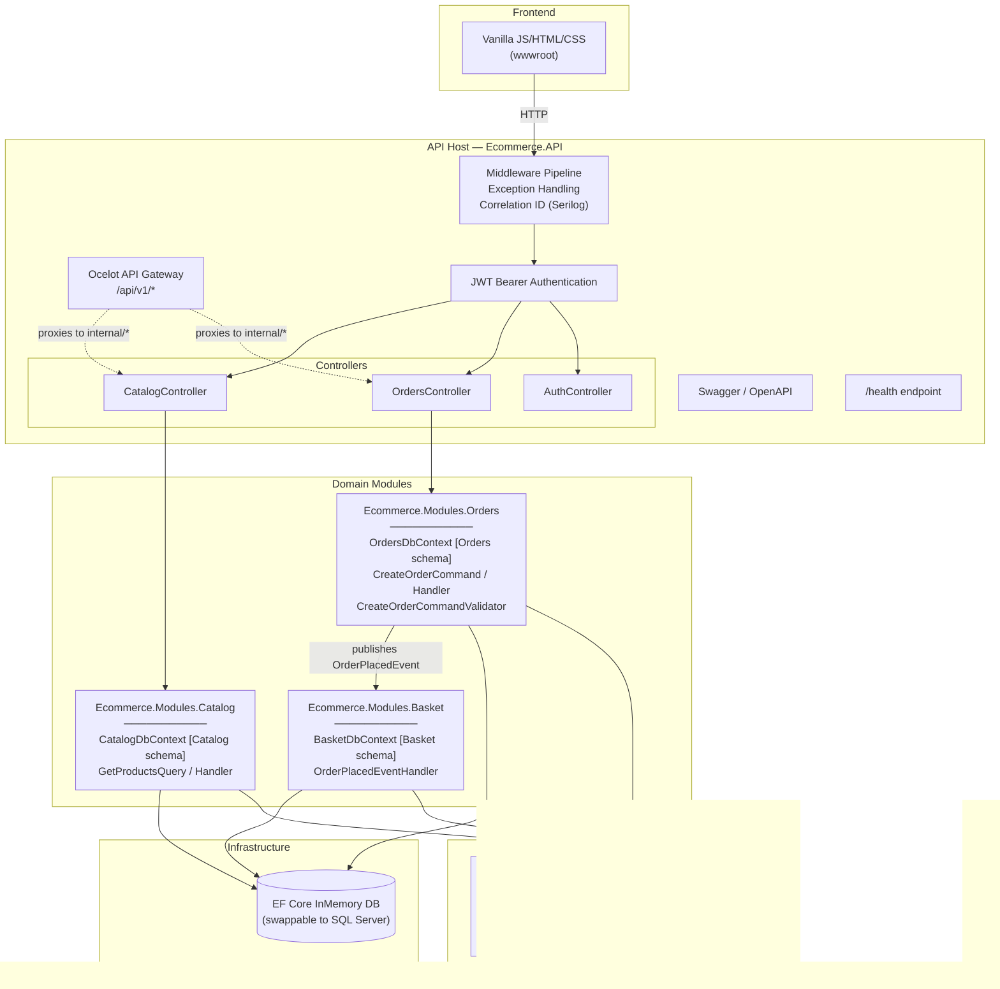
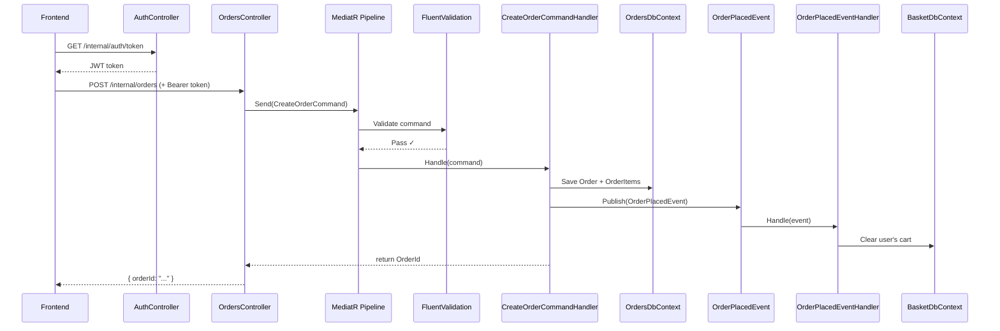

# ShopNova — E-Commerce Modular Monolith: Interview Preparation Guide

## 1. Project Summary

ShopNova is an enterprise-grade E-Commerce Order System built with **.NET 8** using a **Modular Monolith** architecture. It demonstrates how to structure a production-ready backend with cleanly separated domain boundaries — without the operational overhead of distributed microservices.

The system includes a working storefront UI, JWT-secured API endpoints, an Ocelot API Gateway, structured logging with correlation tracing, and a full CQRS pipeline with domain event-driven cross-module communication.

> [!TIP]
> **One-liner pitch for interviews:** "I built a modular monolith e-commerce platform in .NET 8 that uses schema-separated bounded contexts, CQRS with MediatR, domain events for cross-module communication, and an Ocelot API Gateway — all runnable with a single `dotnet run` command."

---

## 2. Architecture Overview



### Data Flow — Placing an Order



---

## 3. Tech Stack

| Layer | Technology | Purpose |
|---|---|---|
| Runtime | .NET 8 | LTS framework |
| ORM | Entity Framework Core 8 (InMemory) | Data access, schema separation |
| CQRS | MediatR | Command/Query separation, domain events |
| Validation | FluentValidation | Request validation via MediatR pipeline behavior |
| Authentication | JWT Bearer | Stateless token-based auth |
| API Gateway | Ocelot | Route proxying, auth policy enforcement |
| Logging | Serilog | Structured logging with correlation ID |
| Testing | NUnit + Moq | Unit tests with mocked dependencies |
| Documentation | Swagger / Swashbuckle | Interactive API explorer |
| Frontend | Vanilla JS, HTML, CSS | Lightweight storefront UI |
| Containerisation | Docker Compose | SQL Server 2022 (optional, for production) |

---

## 4. Module Breakdown

### 4.1 Ecommerce.Shared (Core Kernel)

The shared kernel contains cross-cutting abstractions that all modules can reference without coupling to each other.

| File | Role |
|---|---|
| `DomainEvent.cs` | Base `record` implementing `INotification`. Carries `EventId` and `OccurredOn` metadata. `OrderPlacedEvent` is defined here. |
| `ValidationBehavior.cs` | Generic `IPipelineBehavior` that intercepts every MediatR request, runs all registered `IValidator<T>` instances, and throws `ValidationException` on failure — before the handler ever executes. |

**Why it matters:** This pattern means validation logic lives beside the command it validates (in the domain module), but the pipeline wiring is centralised. Adding a new validator is zero-config — FluentValidation auto-discovers it from the assembly scan.

### 4.2 Ecommerce.Modules.Catalog

| File | Role |
|---|---|
| `CatalogDbContext.cs` | EF Core context with `HasDefaultSchema("Catalog")`. Defines the `Product` entity. |
| `GetProductsQuery.cs` | MediatR query + handler. Returns all products from the catalog. |

**Schema separation** — Each module's `DbContext` targets a different schema (`[Catalog]`, `[Basket]`, `[Orders]`), enforcing domain boundaries at the database level. In production with SQL Server, these become actual separate schemas in the same database.

### 4.3 Ecommerce.Modules.Orders

| File | Role |
|---|---|
| `OrdersDbContext.cs` | Context with `[Orders]` schema. Defines `Order` and `OrderItem` entities. |
| `CreateOrderCommand.cs` | MediatR command + handler. Persists the order, then publishes `OrderPlacedEvent`. |
| `CreateOrderCommandValidator.cs` | FluentValidation rules — requires non-empty `UserId` and at least one `ProductId`. |

**Key design point:** The handler publishes a domain event *after* the database write. This is an eventual-consistency pattern. The Orders module has zero knowledge of what the Basket module does with the event.

### 4.4 Ecommerce.Modules.Basket

| File | Role |
|---|---|
| `BasketDbContext.cs` | Context with `[Basket]` schema. Defines `ShoppingCart` and `CartItem`. |
| `OrderPlacedEventHandler.cs` | Subscribes to `OrderPlacedEvent`. Finds the user's cart and clears it. |

**Cross-module communication pattern:** The Basket module has a project reference to `Ecommerce.Shared` (for the event type) but has **no reference** to `Ecommerce.Modules.Orders`. Communication is entirely through the MediatR event bus. This is the key principle of a modular monolith — modules are decoupled at the code level even though they run in the same process.

### 4.5 Ecommerce.API (Host)

| File | Role |
|---|---|
| `Program.cs` | Composition root. Registers all services, middleware, seeds demo data. |
| `CatalogController` / `OrdersController` / `AuthController` | Thin controllers that delegate to MediatR. No business logic. |
| `CorrelationIdMiddleware.cs` | Extracts or generates `X-Correlation-ID`, pushes it into Serilog's `LogContext`, and echoes it back on the response. |
| `ExceptionHandlingMiddleware.cs` | Global try/catch. Returns structured JSON errors. Catches `ValidationException` specifically (400) vs generic exceptions (500). |
| `ocelot.json` | Route definitions mapping `/api/v1/*` to internal controller endpoints. |

### 4.6 Ecommerce.Tests

| File | Role |
|---|---|
| `CreateOrderCommandHandlerTests.cs` | Tests the order creation flow end-to-end using an InMemory database and a mocked `IMediator`. Verifies both data persistence and domain event publication. |

---

## 5. Key Design Patterns & Decisions

### 5.1 Why Modular Monolith over Microservices?

> **Interview answer:** "Microservices introduce significant operational complexity — service discovery, distributed tracing, network latency, eventual consistency, deployment orchestration. A modular monolith gives you the same domain isolation and boundary enforcement, but with a single deployment unit, shared transactions, and zero network overhead between modules. It's the right starting point for most teams, and you can extract modules into microservices later when scale demands it."

### 5.2 CQRS with MediatR

Commands (`CreateOrderCommand`) and Queries (`GetProductsQuery`) are separated into distinct request types. This enforces single-responsibility at the handler level and makes the codebase easy to navigate — you can grep for any command/query name and find exactly one handler.

### 5.3 Domain Events for Cross-Module Communication

Instead of the Orders module calling a Basket service directly (which would create a circular dependency), it publishes an `OrderPlacedEvent`. Any module can subscribe. This is the **Observer pattern** applied at the domain level.

### 5.4 Pipeline Behaviors (Cross-Cutting Concerns)

`ValidationBehavior<TRequest, TResponse>` sits in the MediatR pipeline and runs *before* every handler. This is the **Decorator pattern** — it wraps handler execution with validation logic. You could add logging, caching, or retry behaviors the same way.

### 5.5 Correlation ID Middleware

Every request gets a unique trace ID. If a client sends `X-Correlation-ID`, we reuse it (important for distributed tracing across services). If not, we generate one. This ID appears in every log line, making it trivial to trace a request through the entire pipeline.

### 5.6 API Gateway Pattern (Ocelot)

External consumers hit `/api/v1/*` routes. Ocelot proxies these to internal controller endpoints. This gives you a single entry point for rate limiting, authentication policy, and route versioning — without exposing your internal route structure.

---

## 6. Likely Interview Questions & Answers

### Q1: "Walk me through what happens when a user places an order."

> The frontend calls `POST /internal/orders` with a JWT in the Authorization header. ASP.NET's authentication middleware validates the token. The request hits `OrdersController`, which dispatches a `CreateOrderCommand` through MediatR. Before the handler runs, the `ValidationBehavior` pipeline intercepts it and runs `CreateOrderCommandValidator` — checking that `UserId` is not empty and at least one product ID is provided. If validation passes, `CreateOrderCommandHandler` creates an `Order` entity with `OrderItem` children, persists them via `OrdersDbContext`, then publishes `OrderPlacedEvent` through MediatR. The Basket module's `OrderPlacedEventHandler` picks up this event and clears the user's shopping cart. The Order ID is returned to the frontend.

### Q2: "Why did you use InMemory database instead of SQL Server?"

> For portfolio portability. Anyone reviewing this on GitHub can clone and run it with a single `dotnet run` — no Docker, no SQL Server installation. The `DbContext` configuration is a one-line swap to `UseSqlServer(connectionString)` for production. The schema separation with `HasDefaultSchema()` still works correctly with the InMemory provider for demonstrating the architectural pattern.

### Q3: "How do the modules communicate without direct references?"

> Through MediatR's `INotification` / `INotificationHandler` pattern. The Orders module publishes an `OrderPlacedEvent` (defined in the Shared kernel). The Basket module subscribes to it via `OrderPlacedEventHandler`. Neither module references the other — they only reference `Ecommerce.Shared`. MediatR handles the dispatch at runtime through its in-process message bus.

### Q4: "What's the difference between your Ocelot routes and internal routes?"

> Internal routes (`/internal/*`) are called directly by the frontend since it's served from the same host. External routes (`/api/v1/*`) go through Ocelot, which adds a layer of gateway concerns — authentication policies, rate limiting potential, and route versioning. In production, Ocelot would point downstream to different service instances if we extracted modules into microservices.

### Q5: "How does your validation pipeline work?"

> FluentValidation validators are auto-discovered via assembly scanning (`AddValidatorsFromAssembly`). `ValidationBehavior` is registered as a MediatR `IPipelineBehavior`, which means it wraps every command handler. When a command enters the pipeline, the behavior finds all registered `IValidator<TCommand>` instances, runs them, and throws a `ValidationException` if any rules fail. The `ExceptionHandlingMiddleware` catches this and returns a 400 response with the validation errors.

### Q6: "How would you handle this in production?"

> Three key changes: swap InMemory to SQL Server, move JWT secrets to Azure Key Vault or environment variables, and add a proper identity provider (e.g. IdentityServer or Azure AD B2C) instead of the demo token endpoint. The architecture itself — CQRS, domain events, gateway — is already production-grade.

### Q7: "What does the Correlation ID give you?"

> Every log line includes the correlation ID. If a user reports an error, I can search logs by that single ID and see the entire request lifecycle — which middleware it passed through, which handler executed, what database calls were made. In a distributed system, the upstream service passes the same correlation ID downstream, giving you end-to-end tracing across services.

### Q8: "Why separate controllers instead of one big controller?"

> Single Responsibility Principle. Each controller maps to one bounded context. `CatalogController` handles product queries, `OrdersController` handles order commands, `AuthController` handles token generation. If we extract the Catalog module into its own microservice later, the controller goes with it — zero refactoring needed.

---

## 7. Architecture Diagram (for whiteboard interviews)

If asked to draw the architecture, sketch this:

```
┌─────────────────────────────────────────────────────────┐
│                     API HOST (.NET 8)                    │
│                                                         │
│  ┌──────────────────────────────────────────────────┐   │
│  │              Middleware Pipeline                   │   │
│  │  ExceptionHandling → CorrelationID → Auth → ...   │   │
│  └──────────────────────────────────────────────────┘   │
│                          │                               │
│         ┌────────────────┼────────────────┐              │
│         ▼                ▼                ▼              │
│  ┌────────────┐  ┌─────────────┐  ┌────────────┐       │
│  │  Catalog   │  │   Orders    │  │   Basket   │       │
│  │  Module    │  │   Module    │  │   Module   │       │
│  │            │  │             │  │            │       │
│  │ [Catalog]  │  │  [Orders]   │  │  [Basket]  │       │
│  │  schema    │  │   schema    │  │   schema   │       │
│  └────────────┘  └──────┬──────┘  └─────▲──────┘       │
│                         │               │               │
│                         └───────────────┘               │
│                      OrderPlacedEvent                    │
│                     (MediatR pub/sub)                    │
└─────────────────────────────────────────────────────────┘
                          │
                    ┌─────┴─────┐
                    │    DB     │
                    │ (single)  │
                    └───────────┘
```

---

## 8. What More Can Be Done (Interviewer-Impressing Enhancements)

These are enhancements you can mention when asked "what would you do next?" — they show you think beyond the current scope.

| Enhancement | Why It Impresses |
|---|---|
| **Integration tests** using `WebApplicationFactory<Program>` | Shows you test the full HTTP pipeline, not just handlers in isolation |
| **Outbox pattern** for domain events | Ensures events aren't lost if the process crashes after DB write but before event publish |
| **Idempotency keys** on order creation | Prevents duplicate orders from network retries — a real-world concern |
| **API versioning** (e.g. `/api/v2/`) | Shows you think about backwards compatibility |
| **Rate limiting** via Ocelot or `AspNetCoreRateLimit` | Demonstrates awareness of API abuse prevention |
| **Caching** with `IMemoryCache` on product queries | Shows you optimise read-heavy paths |
| **Background job processing** (e.g. Hangfire) | For async tasks like sending order confirmation emails |
| **Event sourcing** on the Orders module | Store order state changes as an append-only event stream |
| **Feature flags** (e.g. LaunchDarkly or custom) | Shows you support gradual rollouts |
| **Observability stack** (OpenTelemetry → Jaeger) | Production-grade distributed tracing beyond just correlation IDs |
| **Extract to microservices** | The modular structure means each module can become its own service with minimal refactoring — this is the entire point of the architecture |

> [!IMPORTANT]
> You don't need to build these — just being able to articulate *what* you'd add and *why* demonstrates senior-level thinking. Interviewers want to see that you understand the trade-offs, not that you over-engineered a portfolio project.

---

## 9. Project Structure Reference

```
E-Commerce Monolith/
├── Ecommerce.sln
├── docker-compose.yml              # Optional SQL Server setup
├── implementation_plan.md
├── walkthrough.md
│
├── Ecommerce.API/                  # Host + Composition Root
│   ├── Program.cs
│   ├── InternalControllers.cs      # Catalog, Orders, Auth controllers
│   ├── CorrelationIdMiddleware.cs
│   ├── ExceptionHandlingMiddleware.cs
│   ├── ocelot.json
│   ├── Dockerfile
│   └── wwwroot/                    # Frontend UI
│       ├── index.html
│       ├── css/styles.css
│       └── js/app.js
│
├── Ecommerce.Shared/               # Cross-cutting kernel
│   ├── DomainEvent.cs
│   └── ValidationBehavior.cs
│
├── Ecommerce.Modules.Catalog/      # Product domain
│   ├── CatalogDbContext.cs
│   └── GetProductsQuery.cs
│
├── Ecommerce.Modules.Orders/       # Order domain
│   ├── OrdersDbContext.cs
│   ├── CreateOrderCommand.cs
│   └── CreateOrderCommandValidator.cs
│
├── Ecommerce.Modules.Basket/       # Shopping cart domain
│   ├── BasketDbContext.cs
│   └── OrderPlacedEventHandler.cs
│
└── Ecommerce.Tests/                # Unit tests
    └── CreateOrderCommandHandlerTests.cs
```
